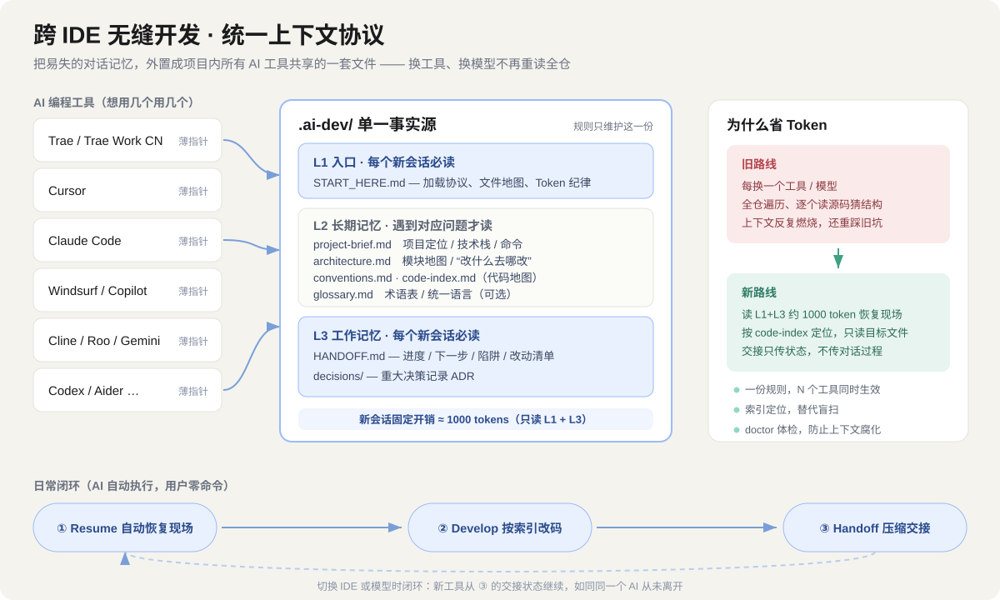

# cross-ide-dev-context

> 让**同一个项目**在任意多个 AI 编程工具 / IDE / 模型之间无缝接续开发：换工具不丢上下文、不重读全仓、不重复烧 token。
>
> 最新版本 **v0.1.2** · 许可证 MIT · 纯 Python 标准库，跨 Windows / macOS / Linux



切换工具之所以贵，是因为 AI 对项目的认知只存在于**易失的对话历史**里——每换一个 IDE 或模型，它都要重新遍历代码库、重新猜结构、重新踩一遍旧坑。

本技能把项目认知**外置成项目内的一套文件 `.ai-dev/`**：规则只维护一份，各工具用十几行的"薄指针"指过来；任何新会话只需读约 1000 token 的入口与交接文件即可恢复现场。

## 解决什么问题

| 浪费来源 | 典型表现 | 本技能对策 |
|---|---|---|
| 全仓遍历 | 每个新工具都 ls/find、逐个打开源码猜结构 | `code-index.md` 代码地图定位，只读目标文件 |
| 规则重复 | 每个工具各维护一套规则，改一次要同步 N 份 | 单一事实源 + 薄指针，规则只写一遍 |
| 长对话重发 | 换模型要带上全部历史，越滚越大 | 收工压缩成结构化 HANDOFF，只传状态不传过程 |
| 探索弯路 | 新工具不知道之前试过什么不行 | HANDOFF「陷阱」区沉淀失败路径与决策 |

## 安装（3 步，零配置）

你只需要"拿到**整个文件夹**、放进 AI 助手的技能目录"，不需要配置任何脚本，也不需要单独安装 Python 包。

### 第 1 步：获取完整文件夹（二选一）

- **方式 A（最简单）**：本仓库页面右上角绿色按钮 **Code → Download ZIP**，解压得到 `cross-ide-dev-context/` 文件夹。
- **方式 B（会用 git）**：

  ```bash
  git clone https://github.com/JacksenHu/cross-ide-dev-context.git
  ```

> 必须是**整个文件夹**（同时含 `SKILL.md`、`scripts/`、`assets/`、`references/`）。不能只拿 `SKILL.md` 一个文件——`scripts/` 里的 .py 是 AI 要调用的工具，缺一不可。

### 第 2 步：放进 AI 助手的"技能目录"

| 助手环境 | 放置位置（举例） |
|---|---|
| 豆包桌面端 | `.user_skills/cross-ide-dev-context/` |
| 其他支持"技能 / 规则 / skills"的 AI 编程助手 | 其文档指定的 skills / rules 目录下，保持同名文件夹 |

放好后**新开会话**（或重启对话）让助手识别到技能。

### 第 3 步：在你的项目里对 AI 说一句话

> "给这个项目接入统一上下文。"

之后建 `.ai-dev/`、扫描代码填写项目文档、生成代码地图、铺工具指针、体检等动作链都由 AI 自动完成，你不需要手动运行任何脚本。

### 你到底需要操心什么？（几乎没有）

| 事项 | 是否需要你做 |
|---|---|
| 安装 / 配置 `scripts/` 里的 .py | **不用**，随文件夹自带，由 AI 自动调用 |
| `pip install` 第三方依赖 | **不用**，全部是 Python 标准库 |
| 自己敲命令或脚本路径 | **不用**，全程对 AI 说话即可 |
| 电脑里安装 Python | **可选**；没装时 AI 会改用文件操作等价完成，不会要求你安装 |
| 指定用哪些 IDE | **不用**，脚本自动识别你正在用的工具 |

## 核心模型：四层上下文

| 层 | 文件 | 读取时机 |
|---|---|---|
| L0 工具指针 | `AGENTS.md`、`CLAUDE.md`、`.cursor/rules/…`、`.trae/rules/…` 等 | 工具启动时自动读，仅十几行，指向 `.ai-dev/` |
| L1 入口 | `.ai-dev/START_HERE.md` | **每个新会话必读** |
| L2 长期记忆 | `project-brief / architecture / conventions / glossary / lessons / code-index` | 遇到对应问题才按需读 |
| L3 工作记忆 | `HANDOFF.md` + `decisions/` | **每个新会话必读**，收工时自动更新 |

新会话固定开销只有 L1 + L3（约 1000 token 量级），L2 与源码按需加载。

## 日常工作流（AI 自动执行）

- **init（每个项目一次）**：初始化 `.ai-dev/`、首份代码索引、工具指针，并由 AI 据实起草 L2 文档。
- **resume（新会话自动）**：读 START_HERE + HANDOFF，沿"下一步"继续。
- **handoff（收工自动）**：压缩更新 HANDOFF；增删文件则更新代码索引；重大决策补 ADR。
- **doctor（体检）**：一键发现空模板文档、过时索引、超长交接、指针漂移、`.ai-dev` 被 git 误忽略等六类腐化，`--fix` 自动修复。

## 已覆盖的 AI 工具（12 种，可扩展）

AGENTS.md 通用兜底（Codex / Amp / Zed）、Claude Code、Cursor（新版 .mdc 与旧版 .cursorrules）、Windsurf、Gemini CLI、GitHub Copilot、**Trae / Trae Work CN**、Cline、Roo Code、Continue、Aider。新增工具只需在 `scripts/_common.py` 的 `TOOL_SPECS` 加一条映射。

## 目录结构

```text
cross-ide-dev-context/
├── SKILL.md                     # 唯一入口：AI 的操作手册（触发判断、自动动作链、降级路径）
├── scripts/                     # AI 调用的工具，用户无需运行
│   ├── init_project.py          # 初始化 .ai-dev + 首份索引 + 工具指针
│   ├── build_index.py           # 生成代码地图（尊重 .gitignore 与 ignore.conf）
│   ├── sync_rules.py            # 生成/校验/注入各工具薄指针（幂等）
│   ├── archive_handoff.py       # 安全归档超长 HANDOFF 历史
│   ├── doctor.py                # 健康体检 + --fix 自动修复
│   └── _common.py               # 工具映射表、项目根探测、忽略匹配
├── assets/templates/            # 初始化时复制进项目的自包含模板
├── references/                  # 分层协议详解 & 各工具集成机制（AI 按需读）
└── docs/context-architecture.svg
```

使用者只与 `SKILL.md`（间接，通过对话触发）打交道；`scripts/`、`assets/`、`references/` 都由 AI 自行取用。

## 脚本命令（供 AI 调用，用户无需手敲）

```bash
python scripts/init_project.py <项目根> [--all] [--force]
python scripts/build_index.py  <项目根> [--max-lines 1200] [--max-depth 4]
python scripts/sync_rules.py   <项目根> [--all] [--inject] [--check]
python scripts/archive_handoff.py <项目根> [--max-lines 120]
python scripts/doctor.py       <项目根> [--fix]   # 0 健康 / 1 警告 / 2 错误
```

全部脚本纯 Python 标准库、跨平台、UTF-8、幂等；手写规则文件默认绝不覆盖。

## 设计原则

1. **用户零命令、零设置**：脚本只由 AI 调用；没有 Python 时 AI 用文件工具等价落地。
2. **单一事实源**：一份规则只存一处，其余位置写路径引用，杜绝 N 份漂移。
3. **薄指针**：工具私有文件只放路标，规则全部回归 `.ai-dev/`。
4. **最小固定开销**：新会话只读 L1+L3，按需才读 L2 与源码。
5. **自包含**：生成进项目的文件不依赖本技能存在，没装技能的 IDE 也能照协议运转。
6. **可防腐**：doctor 体检 + HANDOFF 归档，让上下文长期可靠。
7. **统一语言**：业务术语只在 `glossary.md` 定义一次，所有文档和代码命名引用它，跨工具说同一种话、省 token。

## 与其他工程流程 skill 的关系

本技能只解决"跨 IDE / 模型的上下文与记忆"这一件事，不替代工程流程类 skill。两者**互补共存**：例如 [mattpocock/skills](https://github.com/mattpocock/skills)（需求追问、TDD、调试、架构改进、issue 流程等）管"怎么把活做对"，本技能管"换工具/模型时现场不丢、不重复烧 token"。可以同时安装，互不冲突。

## 适合 / 不适合

- 适合：一个项目要在多个 AI IDE/模型间切换；团队想统一各工具的 AI 协作规范；希望显著降低重复读码的 token 成本。
- 不替代：版本控制（仍建议 git）、正式架构评审工具、实时协同编辑。

## License

[MIT](LICENSE)
